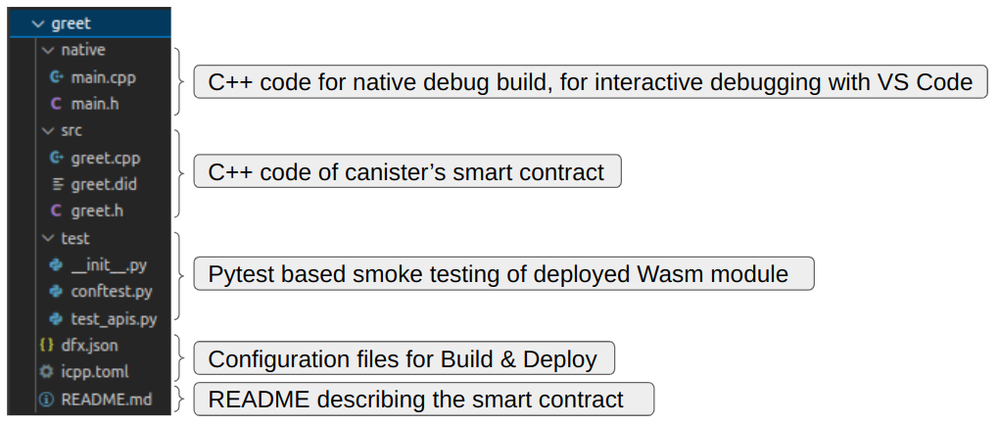

# icpp

Modern C++ for the [Internet Computer](https://internetcomputer.org/).

## What is icpp

icpp is a command-line application for compiling C++20 code to WebAssembly that runs in a canister of the Internet Computer:

- Receive and send Candid messages. 
- Linux, Mac and Windows.
- A development, debug, test & smoke-test framework

icpp is an open source project. If you’d like to contribute, [fork us on GitHub](https://github.com/icppWorld/icpp)!


## Release Status

icpp is under development and does not yet support all Candid Types.

See the Release Notes below for details.


## What is the Internet Computer

The **Internet Computer (IC)** is a public block-chain network replacing conventional IT by using *Chain Key technology* and *Threshold Relay consensus*. 

At it's core, the IC is a collection of *canisters*. 

A *canister* is an isolated environment to run WebAssembly with a system API to receive and send *messages*.

A *message* is a sequence of bytes that can come from anywhere on the web or from other canisters. The bytes sequence must follow a certain convention, as defined by the ***Candid*** specification.

When receiving a message, the API provided by icpp transparently maps the bytes sequence onto a C++ data structure to use in your code, and vice versa when sending a message.

# Installation

## Install icpp

`icpp` is a python package. Install it with:

```bash
pip install icpp
```

*It is recommended to install `icpp` in a Python virtual environment, like [Miniconda](https://docs.conda.io/en/latest/miniconda.html) or  [venv](https://docs.python.org/3/tutorial/venv.html#creating-virtual-environments)*

## Install wasi-sdk

Install the [wasi-sdk](https://github.com/WebAssembly/wasi-sdk) compiler with:

```bash
icpp install-wasi-sdk
```

If a wasi-sdk binary is not available for your system, you can build it yourself using the instructions provided [here](https://github.com/WebAssembly/wasi-sdk#build), and then install it in `~/.icpp/wasi-sdk-16.0`

After installation of the wasi-sdk compiler, your folder layout must look as follows:

```bash
<Your Home>/
|- .icpp/
|  |- wasi-sdk-16.0/
|  |  |- bin/
|  |  |- lib/
|  |  |- share/
```

## Install dfx

`dfx` is the command-line interface for managing your Internet Computer project. 

### Linux & Mac

You can install with `curl`:

```bash
sh -ci "$(curl -fsSL https://internetcomputer.org/install.sh)"
```

This command will install a binary compatible with your operating system, and add it to `/usr/local/bin`.

### Windows

`dfx` is not available for Windows. 


## Optional: Install VS Code

Install VS Code, with these extensions:

| Extension                                                    | Author         | Description                                                  |
| ------------------------------------------------------------ | -------------- | ------------------------------------------------------------ |
| C/C++                                                        | Microsoft      | C/C++ IntelliSense, debugging, and code browsing.            |
| C/C++ Extension Pack                                         | Microsoft      | Popular extensions for C++ development in Visual Studio Code. |
| [CodeLLDB](https://github.com/vadimcn/vscode-lldb/blob/v1.8.1/MANUAL.md) | Vadim Chugunov | A native debugger powered by [LLDB](https://lldb.llvm.org/status/goals.html) |


## Optional: Install Clang

To interactively debug in VS Code, install the [Clang compiler](https://clang.llvm.org/) and make `clang` & `clang++` available on the path. 

### Linux (Ubuntu)

```bash
# Find the latest clang version
sudo apt-cache search clang

# Install it
sudo apt install clang-14

# Create soft links for compiler executables
sudo ln --force -s /usr/bin/clang-14 /usr/bin/clang
sudo ln --force -s /usr/bin/clang++-14 /usr/bin/clang++
```

### Mac

[Install Xcode Command Line Tools](https://mac.install.guide/commandlinetools/2.html), which includes the Clang compiler.

### Windows

From [winlibs.com](https://winlibs.com/) download the latest `UCRT` runtime that includes the `LLVM/Clang/LLD/LLDB` compiler, for example: `GCC 11.2.0 + LLVM/Clang/LLD/LLDB 14.0.0 + MinGW-w64 9.0.0 (UCRT)`

Unzip the file, and copy the `mingw32` or `mingw64` folder to your C drive. After this, the compilers will be available in:

```bash
# For 32 bit systems
C:\mingw32\bin\clang
C:\mingw32\bin\clang++

# For 64 bit systems
C:\mingw64\bin\clang
C:\mingw64\bin\clang++
```

Add the `C:\mingw32\bin` or `C:\mingw64\bin` path to the system environment variable `Path`.

### Verify Installation

On all OS systems, verify the installation in a terminal with:

```bash
clang --version
clang++ --version
```


# Getting Started

## Create the `greet` project

Create the `greet` starter project with:

```bash
icpp init
```

This will create a complete C++ project, with:




## Start local network

Start the local network with:

```bash
dfx start --clean --background
```


## Deploy

Deploy the `greet` canister to the local network with:

```bash
dfx deploy
```

- dfx uses the `icpp build-wasm` command as specified in the `dfx.json` file
- icpp will compile the C++ files defined in the `icpp.toml` file and create the wasm
- dfx then deploys the wasm to the canister as usual

## Test

### Test with dfx

You can test the APIs from the command line, using `dfx canister call`.

For example, call the `greet_2` API of your deployed `greet` canister with:

```bash
$ dfx canister --network local call greet greet_2 '("C++ Developer")'
("hello C++ Developer!")
```


### Test with Candid UI

You can also test the APIs from your browser, using the [Candid UI](https://internetcomputer.org/docs/current/developer-docs/build/backend/candid-ui).

Note that the `.did` file is not (yet) embedded in the wasm, so you need to provide both the `canister ID` and the `did file`.


### Test automation with pytest

icpp comes with a smoke testing framework.

To run the automated API tests against your deployed canister, issue this command:

```bash
# from directory: `greet`
$ pytest --network local
=================== test session starts ===================
platform linux -- Python 3.10.8, pytest-7.2.0, pluggy-1.0.0
rootdir: /home/<path>/icpp
plugins: anyio-3.6.2
collected 4 items                                         

test/test_apis.py ..                                [100%]

==================== 4 passed in 0.13s ====================

```

Notes:

- `pytest` is installed automatically with icpp.

- `pytest` will automatically detect the test folder:

```bash
greet/
|- test/
|  |- conftest.py   # pytest fixtures
|  |- test_apis.py  # the API tests
|  |- __init__.py   # empty file turning `test` into a python package
                    # -> required by pytest to resolve fixture imports
```

## Develop

icpp comes with a native development framework.

To create a native executable with the build in Mock IC, use the command:

```bash
$ icpp build-native
```

### Debug with VS Code

Create configuration files in the `.vscode`  folder of your project similar to this:

#### File: `.vscode/launch.json`

This will allow you to start the debugger and set breakpoints in your C++ smart contract code:


```json
{
    "version": "0.2.0",
    "configurations": [
        {
            "type": "lldb",
            "request": "launch",
            "name": "Debug",
            "program": "${workspaceFolder}/greet/build-native/mockic.exe",
            "args": [],
            "cwd": "${workspaceFolder}"
        }
    ]
}
```


#### File: `.vscode/c_cpp_properties.json`

This one is for Linux, but it will be similar for Windows & Mac.

It will provide the usual C++ code checking & completion.

```json
{
    "configurations": [
        {
            "name": "Linux",
            "includePath": [
                "${workspaceFolder}/**"
            ],
            "defines": [],
            "compilerPath": "/usr/bin/clang++",
            "cStandard": "c17",
            "cppStandard": "c++20",
            "intelliSenseMode": "linux-clang-x64"
        }
    ],
    "version": 4
}
```

## IC Limitations

For the most part you can write any style of C++20, but the IC has two limitations to be aware of.

### No file system

If your C++ code is making use of the file system, you  will get an error message during compile time.

icpp uses the wasi-sdk compiler and sometimes, even when you are not using the file-system, the compiled Wasm module still includes functions that use the file-system and as a result it adds external system interfaces that the IC canister system API does not support. You will get an error during deployment to the canister.

To work around that issue, we have implemented traps to stub those functions. This allows you to compile & deploy your code without the system interfaces being added to the Wasm module, and if it so happens that you actually do use them, a trap with a clear message will occur at runtime.

### 300 Globals

The IC has a hard limit allowing only 300 globals.

If your compiled Wasm module has more, then you will get this error message during deployment:


```bash
$ dfx deploy
...
Error: Failed while trying to deploy canisters.
Caused by: Failed while trying to deploy canisters.
  Failed while trying to install all canisters.
    Failed to install wasm module to canister 'greet'.
      Failed to install wasm in canister 'rrkah-fqaaa-aaaaa-aaaaq-cai'.
        Failed to install wasm.
          The Replica returned an error: code 5, message: 
          "Wasm module of canister rrkah-fqaaa-aaaaa-aaaaq-cai is not valid: 
          Wasm module defined 667 globals which exceeds the maximum number allowed 300."
```

You can check how many globals are in your compiled Wasm module with these commands:

```bash
icpp build-wasm
wasm2wat <path-to-wasm> | grep "(global (;" | wc
```

We have found that the following creates many globals in the Wasm module and you must avoid using it:

- From the `sstream` module:
  - `std::stringstream`
  - `std::istringstream`

# Release Notes

## Release 0.1.x

The focus for release 0.1.x is to provide a complete development, test & interactive debug environment, supporting everything you need to create stateless C++ web applications running on the IC.

The Getting Started guide above demonstrates how to use icpp with your C++ code.

JSON is a common data structure for stateless C++ web applications, and release 0.1.0 provides support for that. As demonstrated in [our QA canister](https://github.com/icppWorld/icpp/blob/3592f8ec82a20fc6349243a03566d959db39a929/test/canisters/canister_1/src/my_canister.cpp#L159) , the nlohmann/json library can be compiled to wasm and the CandidTypeText can be used to transfer JSON data in & out of the canister.

### icpp commands

The command `icpp --help` will list of all the available commands.

| Command               | Release Version |
| --------------------- | --------------- |
| icpp build-native     | 0.1.0           |
| icpp build-wasm       | 0.1.0           |
| icpp init             | 0.1.0           |
| icpp install-wasi-sdk | 0.1.0           |

### from_wire & to_wire

icpp provides two APIs to interact with the canister system API:

- `from_wire`:  API for retrieving the Candid data coming in
- `to_wire`:  API for sending Candid data out

Reference: [Candid Types](https://github.com/dfinity/candid/blob/master/spec/Candid.md#types)

| CandidType          | from_wire | to_wire | Notes                                                        |
| ------------------- | --------- | ------- | ------------------------------------------------------------ |
| CandidTypeNull      | 0.1.0     | 0.1.0   |                                                              |
| CandidTypeBool      |           | 0.1.0   |                                                              |
| CandidTypeNat       |           | 0.1.0   | Values up to __uint128_t                                     |
| CandidTypeInt       | 0.1.0     | 0.1.0   | Values up to __int128_t                                      |
| CandidTypeNat8      |           |         |                                                              |
| CandidTypeNat32     |           |         |                                                              |
| CandidTypeNat64     |           |         |                                                              |
| CandidTypeInt8      |           |         |                                                              |
| CandidTypeInt16     |           |         |                                                              |
| CandidTypeInt64     |           |         |                                                              |
| CandidTypeFloat64   |           | 0.1.0   |                                                              |
| CandidTypeText      | 0.1.0     | 0.1.0   |                                                              |
| CandidTypeReserved  |           |         |                                                              |
| CandidTypeEmpty     |           | 0.1.0   |                                                              |
| CandidTypePrincipal |           |         |                                                              |
| CandidTypeOpt       |           |         |                                                              |
| CandidTypeVec       |           |         |                                                              |
| CandidTypeRecord    | 0.1.0     | 0.1.0   | With fields listed in `from_wire` column <br>Nested Records not yet available. |
| CandidTypeVariant   |           |         |                                                              |

