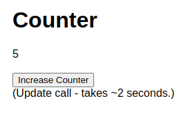

# `canister_http`

A QA canister for testing the functionality that allows you to build conventional style web services, without having to interact with Candid on both the server (your canister) and the client side.

## HTTPS incalls 

As described in [The HTTP Gateway Protocol Specification](https://internetcomputer.org/docs/current/references/http-gateway-protocol-spec):

*The HTTP Gateway Protocol is an extension of the Internet Computer Protocol that allows conventional HTTP clients to interact with the Internet Computer network. This is important for software such as web browsers to be able to fetch and render client-side canister code, including HTML, CSS, and JavaScript as well as other static assets such as images or videos. The HTTP Gateway does this by translating between standard HTTP requests and API canister calls that the Internet Computer Protocol will understand.*


A canister can be turned into a HTTPS web-server by implementing two methods:
1. `http_request` 
2. `http_request_update`

When a web-client calls the canister, the IC will route the call to these methods. 

Example web-client calls for this canister:

### curl

```bash
# IC mainnet (see canister_ids.json)
$ curl -X GET https://5ugrv-zqaaa-aaaag-acfna-cai.raw.icp0.io/counter
{"counter":1}

$ curl -X POST https://5ugrv-zqaaa-aaaag-acfna-cai.raw.icp0.io/counter
{"counter":2}

$ curl -X GET https://5ugrv-zqaaa-aaaag-acfna-cai.raw.icp0.io/counter
{"counter":2}
 

# local network
$ curl -X GET http://$(dfx canister id my_canister).raw.localhost:$(dfx info webserver-port)/counter
# typically resolves to:
$ curl -X GET http://bkyz2-fmaaa-aaaaa-qaaaq-cai.raw.localhost:4943/counter
```

### HTML / Javascript: Fetch

See: [counter.html](https://github.com/icppWorld/icpp-pro/blob/main/test/canisters/canister_http/counter.html)



## HTTPS outcalls

🚧 *This capability is currently under development!* 🚧

A canister can make an [HTTPS outcall](https://internetcomputer.org/docs/current/developer-docs/integrations/https-outcalls/) to conventional Web 2.0 HTTP servers running anywhere on the web.

Carefully read the [how it works](https://internetcomputer.org/docs/current/developer-docs/integrations/https-outcalls/https-outcalls-how-it-works) document and especially the [known limitations](https://internetcomputer.org/docs/current/developer-docs/integrations/https-outcalls/https-outcalls-how-it-works#known-limitations) section. Some key take-aways:

- The canister making an HTTPS outcall acts as an HTTP client.
- The HTTP request is made by every replica of the subnet.
- HTTPS outcalls are always update calls, even when the method is GET, because they go through consensus. 
- The [pricing](https://internetcomputer.org/docs/current/developer-docs/integrations/https-outcalls/https-outcalls-how-it-works#pricing) is based on your setting of `max_response_bytes`, and the actual response size is not considered.
  - `WARNING`: If not set, the default value is `2 MB` !!!
- A response is only returned if the replicas reach consensus, else an error is returned.
- You can provide an optional [transformation function](https://internetcomputer.org/docs/current/developer-docs/integrations/https-outcalls/https-outcalls-how-it-works#transformation-function), run on each replica, to fix responses that are similar but not identical.
  - The transformation function must be provided by the canister programmer and is exposed by the canister as a query.
- [POST requests must be idempotent](https://internetcomputer.org/docs/current/developer-docs/integrations/https-outcalls/https-outcalls-how-it-works#post-requests-must-be-idempotent) on the Web2.0 HTTP server.


